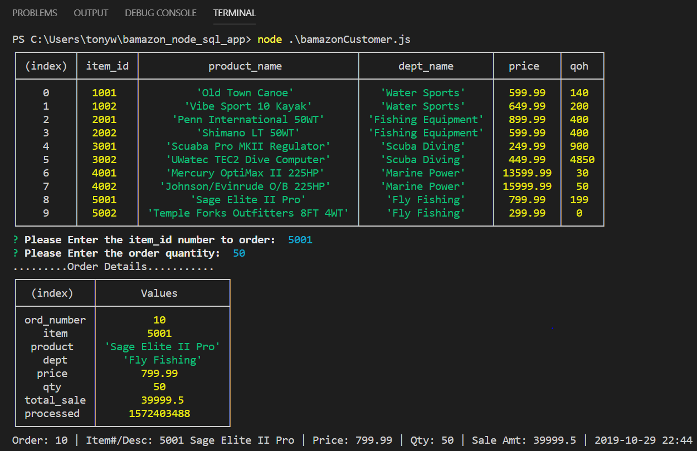
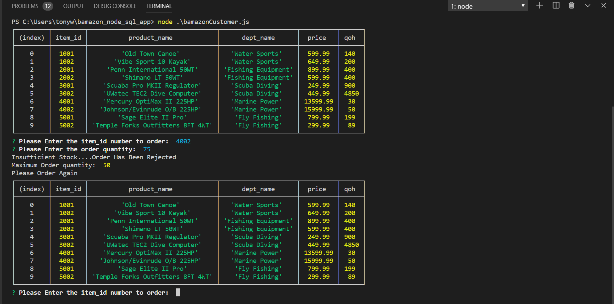

# bamazon_node_sql_app

The objective of the activity is to create an "Amazon"-like store front CLI application using node and mysql.  The app will use 2 tables in mysql database bamazon.

The app will perform the following specifications:

    mySQL database table `products`.  (An "orders" table was additionaly created to record each sale)

    Provide a list of products for sale with inventory on hand information

    Inquirer command line prompts will accept order input of item number and quantity
        a function will take the response and access the record in products table
        
        If order quantity can be fullfilled, a database insert into the orders table will record the order data.  The new order record will then be retrieved and sent to the terminal screen as a recordset or console log message.  The qoh available will be updated in the products table.

        If inventory on hand is below the order quantity the order will be rejected and a console.log message will indicate order was rejected, provide a maximum amount available and relist the product list.  The inquirer prompt will request a new order request.

 Requried npm node packages:
    
    * inquirer
    * mysql
    * moment

    package.json contains initialization parameters 

Inital run of bamazonCustomer.js and details of first item ordered

Bottom half of above screenshot.  Item 5002 has inventory deducted by xx from xxx to xx.

Demostrates a rejected order where ordered quantity exceeded quantity on hand.  
Message indicates order rejected and provides the maximum available quantity that can be ordered.

